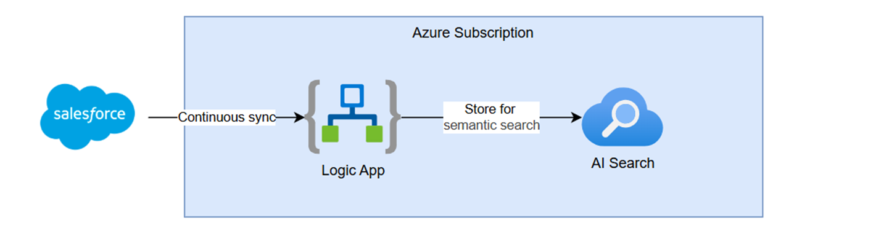
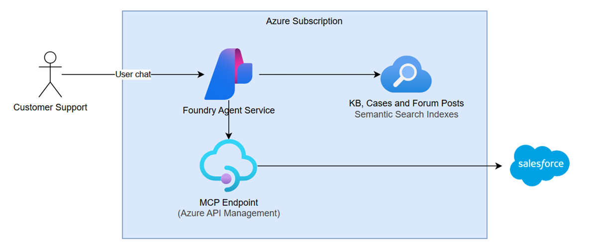

# Foundry IQ — AI-Powered IT Helpdesk with Salesforce Integration

A demo showing how **Azure AI Foundry agents** integrate with **Salesforce** to power an intelligent IT helpdesk. An AI agent (Foundry IQ) assists support engineers by searching a knowledge base in Azure AI Search and managing Salesforce cases through an APIM-hosted MCP server. **NimbusCloud is a fictitious SaaS company** used as the scenario — all products, support cases, and knowledge articles are synthetic.

## Architecture Overview

The solution has two main data flows:

**Salesforce ↔ AI Search sync** — A Logic App listens for case changes in Salesforce and keeps the Azure AI Search index up to date so the agent always has current information.



**Agent chat** — Users interact with an Azure AI Foundry agent that is grounded on the AI Search knowledge base. When the agent needs to create or update a Salesforce case, it calls tools exposed through an APIM-hosted MCP server that authenticates to Salesforce via OAuth client credentials.



## Prerequisites

- [Azure CLI](https://docs.microsoft.com/cli/azure/install-azure-cli) (`az`)
- [Azure Developer CLI](https://learn.microsoft.com/azure/developer/azure-developer-cli/install-azd) (`azd`)
- [Python 3.10+](https://www.python.org/downloads/) with `pip`
- An Azure subscription with **Contributor** and **User Access Administrator** roles
- A Salesforce developer account (created in [Step 1](#step-1--salesforce-developer-account))

---

## Step 1 — Salesforce Developer Account

You need a Salesforce environment for the case management integration. A free developer org works fine for demos. **The Bicep deployment requires your Salesforce credentials**, so this must be done first.

### Create a developer org

1. Sign up at [developer.salesforce.com](https://developer.salesforce.com/signup)
2. Verify your email and log in

### Create a Connected App (OAuth)

The APIM policy and Python scripts use the OAuth 2.0 **client_credentials** flow.

> **Salesforce docs:**
> - [Create a Connected App](https://help.salesforce.com/s/articleView?id=sf.connected_app_create.htm)
> - [Enable OAuth Settings for API Integration](https://help.salesforce.com/s/articleView?id=sf.connected_app_create_api_integration.htm)
> - [Configure the Client Credentials Flow](https://help.salesforce.com/s/articleView?id=sf.connected_app_client_credentials_setup.htm)

1. In Salesforce Setup, go to **App Manager** → **New Connected App**
2. Enable **OAuth Settings**:
   - Callback URL: `https://login.salesforce.com/services/oauth2/callback`
   - Scopes: `api`, `refresh_token`
3. Save and note the **Consumer Key** (client ID) and **Consumer Secret**
4. Under **Manage** → **Edit Policies**, set "Permitted Users" to **Admin approved users are pre-authorized**
5. Assign a Permission Set or Profile to authorize the Connected App

### Record your credentials

Copy the template to create your local `.env` file, then fill in your Salesforce values:

```bash
cp .env.template .env
```

Open `.env` and set the three Salesforce fields:

| Variable | Value |
|---|---|
| `SFDC_CLIENT_ID` | Consumer Key from the Connected App |
| `SFDC_CLIENT_SECRET` | Consumer Secret from the Connected App |
| `SALESFORCE_TOKEN_ENDPOINT` | `https://<your-domain>.my.salesforce.com/services/oauth2/token` |

> **Token Endpoint format:** For developer orgs this is typically something like `https://orgfarm-xxxxx-dev-ed.develop.my.salesforce.com/services/oauth2/token`

---

## Step 2 — Deploy Azure Infrastructure

The Bicep templates in `infra/` provision all core resources: AI Foundry (hub + project), Azure AI Search, APIM (with Salesforce case-creation API), Logic Apps, Key Vault, and supporting services.

The deployment stores your Salesforce credentials (from Step 1) in Key Vault and configures APIM named values to reference them.

> **Note:** The initial deployment can take **~45 minutes**, primarily due to the APIM Developer-tier instance provisioning.


```bash
azd auth login
azd init                          # first time only — creates .azure/ environment
azd env set AZURE_LOCATION eastus2
azd provision                     # loads .env automatically, provisions infrastructure
```

> The preprovision hook in `azure.yaml` reads your `.env` file and sets `SFDC_CLIENT_ID`, `SFDC_CLIENT_SECRET`, and `SALESFORCE_TOKEN_ENDPOINT` in the azd environment. These are passed to the Bicep templates as secure parameters and stored in Key Vault.

### Post-deployment outputs

After provisioning, note these values (available via `azd env get-values`):

| Output | Description |
|--------|-------------|
| `AZURE_SEARCH_ENDPOINT` | AI Search service URL |
| `AZURE_OPENAI_ENDPOINT` | AI Foundry / OpenAI endpoint |
| `AZURE_SEARCH_INDEX` | Knowledge base index name (`helpdesk-knowledge`) |
| `AZURE_APIM_ENDPOINT` | APIM gateway URL |
| `AZURE_KEYVAULT_NAME` | Key Vault for Salesforce credentials |

### Role assignments

The Bicep templates create most RBAC assignments automatically. If you hit permission errors later, `infra/assign-roles.ps1` is a reference script that creates all required role assignments via CLI. **Edit the hardcoded resource group, subscription ID, and resource names at the top of the file before running it.**

---

## Step 3 — Load Data into AI Search

The loader script assigns required RBAC roles and populates all three AI Search indexes (`helpdesk-knowledge`, `community-forum-posts`, `service-cases`) from the markdown files in this repo.

### Install dependencies

```bash
pip install -r scripts/requirements.txt
```

### Authenticate

The scripts use `DefaultAzureCredential`, so make sure you're logged in:

```bash
az login
```

### Run the loader

```powershell
.\scripts\load-search-data.ps1
```

> **Tip:** Re-run this script any time you update the markdown content. Documents are upserted by ID.

---

## Step 4 — Create Azure AI Foundry Knowledge Base (Portal)

This connects AI Foundry to the AI Search indexes so agents can retrieve grounded answers.

1. Open the [Azure AI Foundry portal](https://ai.azure.com) and navigate to your project (created by the Bicep deployment)
2. In the left nav, click **Knowledge** and connect to your AI Search instance
3. Click **Create a knowledge base**
4. Choose the type **AI Search Index**
5. Select one of the three indexes created with the test data (`helpdesk-knowledge`, `community-forum-posts`, or `service-cases`) and give the knowledge base a name (e.g., `nimbuscloud-helpdesk-kb`)
6. Within the same knowledge base, click **+ New knowledge source** and add the other two indexes — you should now have a single knowledge base with three knowledge sources
7. Choose gpt-4.1 for the chat completion model
8. Set reasoning level to Medium.
9. Click Save Knowledge base.

---

## Step 5 — Create APIM MCP Endpoint (Portal)

The Bicep templates deploy the APIM instance, REST API, policies, and product, but the **MCP server endpoint itself must be created manually** in the Azure Portal. This is not yet supported via Bicep, ARM, or CLI.

> Reference: see the comment in `infra/apim.bicep` (line ~355): _"The MCP server is created via the Azure portal and must also be added to this product manually or via az rest."_

### Steps

1. Open the [Azure Portal](https://portal.azure.com) → your APIM instance
2. Navigate to **APIs** → **MCP Servers** in the left nav
3. Click **Create MCP Server** → **Expose an API as an MCP Server**
4. Choose the **Create Case** endpoint
5. Give it a name (e.g., `salesforce-case-mcp`)
6. Assign it to **all products**
7. Copy the MCP endpoint URL — you'll need it in Step 6

### What the Bicep already deployed

- **API operations:** `POST /cases` (Create Case) with inbound policy that handles Salesforce OAuth token exchange and case creation
- **Product:** `ai-foundry-agents` with a subscription key
- **Key Vault secrets:** Salesforce client ID and secret (referenced by the APIM policy via managed identity)

---

## Step 6 — Create the AI Foundry Agent

Create an agent in Azure AI Foundry that is grounded on the knowledge base and can create Salesforce cases via the APIM MCP tool.

The script creates the agent with the model and system prompt from `AGENT_INSTRUCTIONS.md`.

```bash
python scripts/create_agent.py
```

After running the script, attach the knowledge base and MCP tool in the portal (see below).

### Attach Knowledge Base and MCP Server (portal — required for both options)

1. In the Foundry portal, go to **Agents** → select the agent
2. Under **Knowledge**, attach the knowledge base created in Step 4
3. Under **Tools** → **MCP Server**, add the APIM MCP endpoint URL from Step 5
4. Enter the subscription key from the `ai-foundry-agents` product
5. Test the agent in the playground to confirm it can:
   - Answer questions using KB content
   - Create Salesforce cases via the MCP tool

---

## Step 7 — Connect Logic Apps to Salesforce (Portal)

The Logic Apps are deployed by Bicep but their Salesforce API connection must be authorized interactively.

1. Open the [Azure Portal](https://portal.azure.com) → your resource group
2. Find the Salesforce API Connection resource (e.g., `salesforce-connection`)
3. Click **Edit API connection** → **Authorize**
4. Sign in with your Salesforce credentials and grant access
5. Click **Save**

Once authorized, the Logic Apps will:
- **Case sync:** Trigger when a Salesforce case is created or modified → generate an AI-enriched summary → update the AI Search `service-cases` index

### Verify

1. Create a test case in Salesforce (or use `python scripts/create_case.py --subject "Test" --description "Testing Logic App trigger" --priority Medium`)
2. Check the Logic App run history in the Azure Portal to confirm it fired
3. Query the AI Search index to see the new document


---

## Step 8 — Test the Agent

With everything connected, run through the demo scenarios:

1. Open [Azure AI Foundry](https://ai.azure.com) → your project → **Agents**
2. Select your agent and open the **Chat** playground
3. Try prompts from `DEMO_PROMPTS.md`, for example:
   - _"We're seeing intermittent timeouts when NimbusHub tries to sync grades to the SIS. What should we check?"_
   - _"Create a P2 case for the NimbusConnect audio issues in virtual classrooms"_
4. Verify the agent:
   - Retrieves relevant KB articles and forum discussions
   - Cites sources in its answers
   - Successfully creates Salesforce cases via the MCP tool

---